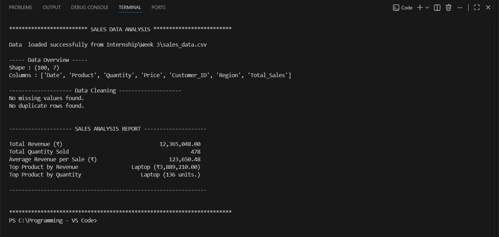

# Sales Data Analysis Report

# Project Overview
This project analyzes a sales dataset containing 100 transactions across five product categories. The goal is to demonstrate basic data analysis skills using Python and Pandas - loading data, cleaning, calculating key metrices and presenting findings in a clear report.

# Code Structure
- sales_analysis.py : Main Python script with functions for loading, cleaning, analyzing and reporting.
- sales_data.csv : Input dataset.
- requirements.txt : Lists required Python packages.

# Technical Details
- Libraries : Pandas (for data manipulation), built-in Python for printing.
- Data Cleaning : Checks for missing values (none found) and duplicates (none found). The dataset was already clean so no changes were needed.
- Analysis Performed :
    - Total revenue (sum of "Total_Sales")
    - Total quantity sold (sum of "Quantity")
    - Average revenue per sale
    - Best selling product by revenue
    - Best selling product by quantity

# Setup Instructions
- Install Python from [python.org](https://python.org)
- Install pandas using pip
- Download/clone this repository.
- Open the folder in VS Code or any other editor.
- Run sales_analysis.py by clicking the Run button or by using the terminal.

# Visual Documentation

# Testing Evidence
The script was tested with the provided sales_data.csv. No errors occured. The following test cases were manually verified.
- Missing value handling : Intentionally removed a value from a copy of the CSV file, the script correctly identified and dropped the row.
- Duplicate handling : Added a duplicate row, the script removed it.
- Metric calculation : Verified a few rows by manual calculation. 